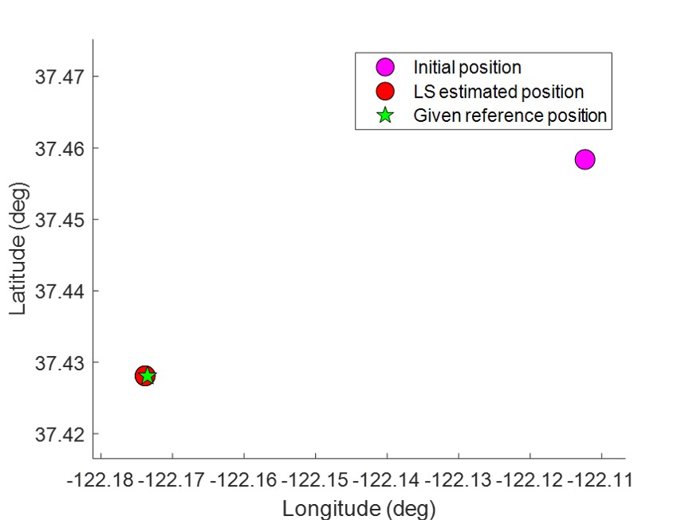

# 2021-22 AAE6102 Satellite Communication and Navigation
## Intorduction

This repository is the assignment and laboratory for 2021-22 Sem. 1, AAE6102 Satellite Communication and Navigation. 

The aim of the assessment is to get familiar with decoding the GPS ephemeris data and using the pseudorange measurements with least-squares (LS) esitmation to resovle the receiver location. 

## Instructions
1. Clone this repository by,
   - command line
   - download the zip file and extract to desired folder
2. Open file '[main_aae6102_assignment_1.m](main_aae6102_assignment_1.m)' in MATLAB
3. Press 'Run'

## Results
Initial position in earth-centred-earth-fixed (ECEF) coordinates (in meter) is `(-2694685.473m, -4293642.366m, 3857878.924m)`. 

The LS is solved iteratively. After several iteration, the ECEF solution (in meter) is `(-2700396.828m, -4292563.343m, 3855271.799m)`. In WGS84 coordinates format with latitude (degree), longitude (degree), and altitude(meter), it is `(37.428085437°, -122.173474221°, 70.629m)`. The estimated receiver clock offset is `519457.068m (0.0017327s)`. The estimated position error is `4.947m`.

NOTE: if you wish to disable troposheric delay correction, please change the value in [Line 12 in main_aae6102_assignment_1.m](main_aae6102_assignment_1.m#L12) to `false`, e.g. `ENA_TROPO_ERR_CORR = false;`

If the code excuted successfully, following figure will be shown.

Please enjoy! :tada:

## Author
For any issues, please contact Hoi-Fung (Ivan) NG via email <21053478R@connect.polyu.hk>

## References
1. ARINC Research Corporation. (2000). GPS Interface Control Document ICD-GPS-200 (IRN-200C-004): Navstar GPS Space Segment and Aviation User Interfaces.
2. Herrera Olmo, Antonio & Suhandri, Hendy & Realini, Eugenio & Reguzzoni, Mirko & Lacy, Maria Clara de. (2015). goGPS: open-source MATLAB software. *GPS Solutions.* 20. 1-9. 10.1007/s10291-015-0469-x. 
3. Takasu Tomoji. (2009). RTKLIB: Open Source Program Package for RTK-GPS. *FOSS4G 2009.* Tokyo, Japan, November 2, 2009.