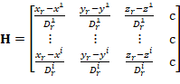

# 2021-22 AAE6102 Satellite Communication and Navigation

  
<h2 style="display: inline-block">Table of Contents</h2>

  <ol>
    <li>
      <a href="#Intorduction">Introdution</a>
    </li>
    <li>
      <a href="#Instructions">Instructions</a>
    </li>
    <li>
      <a href="#Code-Explanation">Code Explanation</a>
    </li>
    <li>
      <a href="#Results">Results</a>
    </li>  
     <li>
      <a href="#References">References</a>
    </li>
     <li>
      <a href="#Author">Author</a>
    </li>
  </ol>

## Intorduction

This repository is the assignment and laboratory for 2021-22 Sem. 1, AAE6102 Satellite Communication and Navigation. 

The aim of the assessment is to get familiar with decoding the GPS ephemeris data and using the pseudorange measurements with least-squares (LS) esitmation to resovle the receiver location. 

## Instructions
1. Clone this repository by,
   - command line
   - download the zip file and extract to desired folder
2. Open file '[main_aae6102_assignment_1.m](main_aae6102_assignment_1.m)' in MATLAB
3. Press 'Run'

## Code Explanation
The code can be divided into two main part. The first part requires us to use the orbit parameters in ephemeris data to resolve the satellites’ ECEF position and satellite clock offset. Followed by forming the linear system based on pseudorange observation. Finally, we can resolve the receiver position and clock offset by LS method. The flowchart is as follows, 

The instruction on how to use the orbit parameters to estimate the satellite position for a given GPS time can be found in (ARINC, 2000). The satellites’ position can be calculated by Table 20-IV in (ARINC, 2000). After we obtained the earth-fixed coordinates, we also apply the earth rotation correction.

where  is the transformed coordinates of each satellite, and will be stored and use for LS later.  are X, Y, and Z coordinates of the satellite following Table 20-IV in (ARINC, 2000).  is the constant of the earth’s rotation rate.  is the travelling time for the signal, such as . This correction is to compensate the signal attenuation during the transmission that caused by the earth rotation.

The implementation can be found in (Realini & Reguzzoni, 2013). In the other hand, the satellite clock offset can also be obtained from ephemeris data, which can refers to equation (2) in (ARINC, 2000). 

After getting the satellite position, we can use the given pseudorange to resolve the receiver position with least squares (LS) estimation. In general, the pseudorange measurement of i-th satellite can be expressed as, 

where  is the geometry distance between the receiver and the i-th satellite, such as . , , and  are the receiver location x, y, and z in ECEF coordinates, respectively. Similarly, , , and  are the i-th satellite position x, y, and z in ECEF coordinates, respectively. c is the constant of speed of light, e.g. 299792458.0 m/s.  is the receiver clock delay.  is the satellite clock offset for i-th satellite which can be determined with the ephemeris data.  and  are the tropospheric and ionospheric delay, respectively. Noted that only the tropospheric delay is going to estimate in this example.  is the other noise from receiver, environment, or commonly system biases. 

In here, we assume the GPS observation is a linear system that follows the normal distribution. The LS system can be expressed as,

where  is a column vector of observation or measurements, such as pseudorange. And the length is the same as the number of available satellites.  is the design matrix which depends on the state that we wish to estimate.  is estimation state. And  is the noise in the system.  is a column vector with a total of four elements in this assessment, and the first three elements are the receiver ECEF position, , in meters, and the fourth element is the receiver clock, , in seconds. 

The noise of the system  usually refers to the error can be estimated with other physical models, such as satellite clock offset and tropospheric error. And these errors are going to estimate in this report as well. Beginning with the satellite clock offset, the linear combination parameters are given by the ephemeris data, and it can be obtained by equation (2) in (ARINC, 2000). 

where , , and  are the polynomial coefficients in ephemeris orbit data.  is the clock data reference time in seconds. And  is the relativistic correction term in seconds, which can be calculated by, 

where , , and  are orbit parameters. And  is the constant equals to .

On the other hand, the tropospheric error is estimated by the Saastamoinen model. In the implementation aspect, this code is going to follow open source code RTKLIB (Takasu, 2009). The tropospheric error can be expressed with the standard Saastamoinen model, 

where  is the zenith angle in radian as , and  is the elevation angle of the i-th satellite. , , and  are standard atmosphere, which can be expressed as,

 
 

where  is the total pressure in hPa,  is the absolute temperature of the air in K, and  is the geodetic height above mean sea level (MSL).  is the partial pressure of water vapor in hPa, and  is the relative humidity. 

The design matrix  represents the physical relationships between the states and observation. Design matrix  and estimation state  can be expressed by,

 

Here, the receiver clock delay unit is in second as the fourth column of the design matrix is the speed of light. If the fourth column value is replaced with ‘1’, the estimated receiver clock delay unit will be meters accordingly. 

As a result, we can estimate the receiver state by LS estimation iteratively. The estimated state change of one iteration yields to, 

where  is the measured pseudorange. And  is the estimated pseudorange. After the change of state in each iteration is estimated, we can update the states by , where  is the initial states or existing states from last iteration. 

The residual of the sum of squared error of the system can be estimated by, 

where  is a scalar term. The LS estimation will terminate when the distance of estimation changes of position states (first three elements in ) smaller than a certain threshold, e.g. . Or the total number of iterations more than a threshold, e.g. 12 in the source code. 

## Results
The calculated satellite ECEF position and clock offset as follow,
| Satellite ID | Satellite ECEF X (m) | Satellite ECEF Y (m) | Satellite ECEF Z (m) | Satellite clock offset (s) | Satellite clock offset (m) |
| ------------ | -------------------- | -------------------- | -------------------- | -------------------------- | -------------------------- |
| 5            | -8855587.377         | -22060120.339        | -11922092.593        |  0.00018907                | 56680.482                  |
| 6            | -8087225.358         | -16945964.648        |  18816194.508        | -0.00000008                | -25.162                    |
| 10           |  9027649.354         |	-12319230.777        |  21737387.598        |  0.00003325                | 9967.388                   |
| 17           | -21277120.383        |	-7467120.981         |  14287503.452        | -0.00020490                | -61428.267                 |
| 22           | -13649527.756        |	 8229508.102         |  21122958.527        |  0.00022268                | 66757.213                  |
| 23           | -19452317.265        | -16750378.609        | -6918520.642         |  0.00001036                | 3105.913                   |
| 26           |  6162914.086         | -25286773.704        | -3541190.268         |  0.00028099                | 84239.633                  |
| 30           | -17713896.270        | -19797468.525        |  19209.132           | -0.00001004                | -3010.256                  |

Initial position in earth-centred-earth-fixed (ECEF) coordinates (in meter) is `(-2694685.473m, -4293642.366m, 3857878.924m)`. 

The LS is solved iteratively. After several iteration, the ECEF solution (in meter) is `(-2700418.609m, -4292537.059m, 3855264.740m)`. In WGS84 coordinates format with latitude (degree), longitude (degree), and altitude(meter), it is `(37.428085437°, -122.173474221°, 70.629m)`. The estimated receiver clock offset is `519449.313m (0.0017327s)`. The estimated position error is `30.004m`.

NOTE: if you wish to disable troposheric delay correction, please change the value in [Line 12 in main_aae6102_assignment_1.m](main_aae6102_assignment_1.m#L12) to `false`, e.g. `ENA_TROPO_ERR_CORR = false;`

If the code excuted successfully, following figure will be shown.

And the variables change and update on each iteration are summarized in follow dryrun table,
| Iterations   | LS solution : position X, Y, Z changed (m)   | LS solution: receiver clock changed  | Residual  (m^2)    | Updated position ECEF (m)     | Updated position WGS84 LLA (deg, deg, m)  | Updated receiver clock offset     | Total positioning error (m)   |
| ------------ |  -------------------------------   | -----------------------------------  | ---------   | ------------------    | ----------------------------------------  | -----------------------------     | ----------------------------  |
| 0 (Initial) | /                              | /                        | /        | -2694685.473, -4293642.366, 3857878.924 | 37.458376433, -122.112338996, -31.456 | /  | 6374.466 |
| 1           | -5732.970, 1105.486, -2614.371 | 0.0017327s (519449.765m) | 1795.743 | -2700418.443, -4292536.880, 3855264.553 | 37.428093219, -122.173840136, 57.578  | 0.0017327s (519449.765m) | 30.073 |
| 2           | -0.165, -0.179, 0.187 | -0.0000000s (-0.452m) | 1813.004 | -2700418.609, -4292537.059, 3855264.740 | 37.428093241, -122.173840639, 57.882  | 0.0017327s (519449.312m) | 30.004 |
| 3           | -0.000, -0.000, 0.000 | 0.0000000s (0.001m) | 1813.000 | -2700418.609, -4292537.059, 3855264.740 | 37.428093241, -122.173840639, 57.882  | 0.0017327s (519449.313m) | 30.004 |
| 4 (Final solution) | -0.000, -0.000, 0.000 | 0.0000000s (0.000m) | 1813.000 | -2700418.609, -4292537.059, 3855264.740 | 37.428093241, -122.173840639, 57.882  | 0.0017327s (519449.313m) | 30.004 |

And skyplot of given dataset is as following, each circle represents one satellite, the color represents its SNR in dBHz, the text inside is the corresponding satellite ID.

From the skyplot we can observed that the satellite is distributing evenly. And the higher elevation angle satellites have higher SNR value, which mean they are healthier probably. If we also calculate different dilution of precision (DOP) value, with

we can have a better understanding to the predicted positioning performance. The calculated DOP value are: Horizontal DOP (HDOP) is `1.48`. The vertical DOP (VDOP) is `0.88`. The position DOP (PDOP) is `1.72`. Finally, the geometry DOP (GDOP) is `1.91`.

Please enjoy! :tada:

## References
1. ARINC Research Corporation. (2000). GPS Interface Control Document ICD-GPS-200 (IRN-200C-004): Navstar GPS Space Segment and Aviation User Interfaces.
2. Herrera Olmo, Antonio & Suhandri, Hendy & Realini, Eugenio & Reguzzoni, Mirko & Lacy, Maria Clara de. (2015). goGPS: open-source MATLAB software. *GPS Solutions.* 20. 1-9. 10.1007/s10291-015-0469-x. 
3. Takasu Tomoji. (2009). RTKLIB: Open Source Program Package for RTK-GPS. *FOSS4G 2009.* Tokyo, Japan, November 2, 2009.

## Author
For any issues, please contact Hoi-Fung (Ivan) NG via email <21053478R@connect.polyu.hk>

